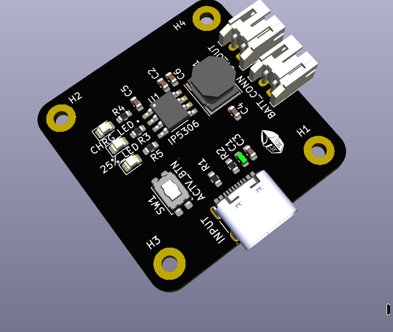
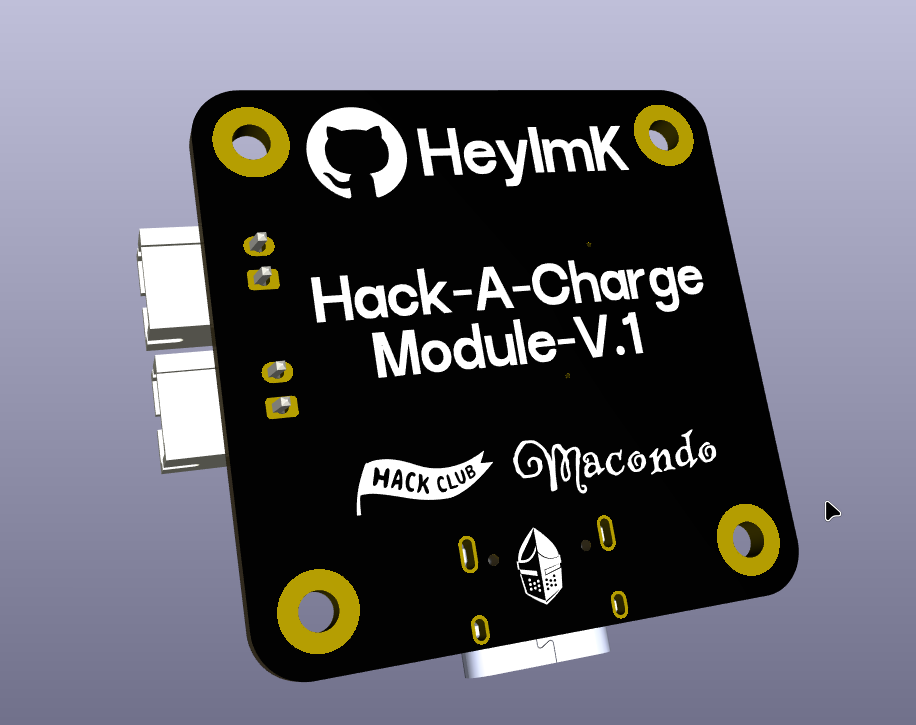
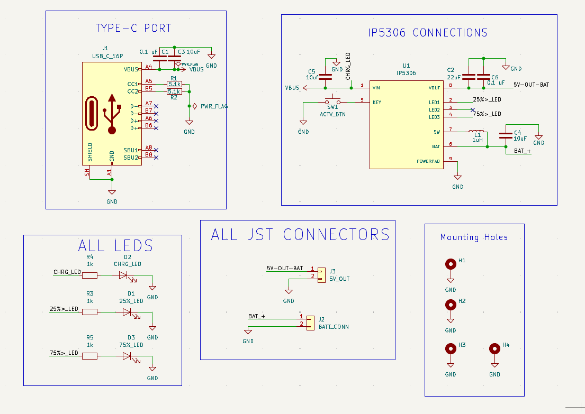
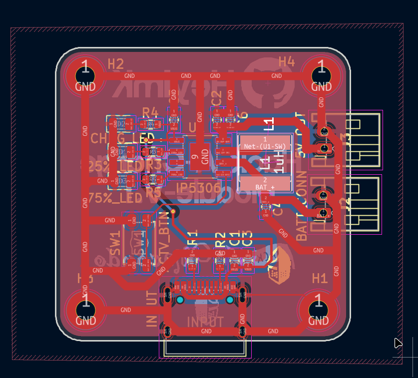
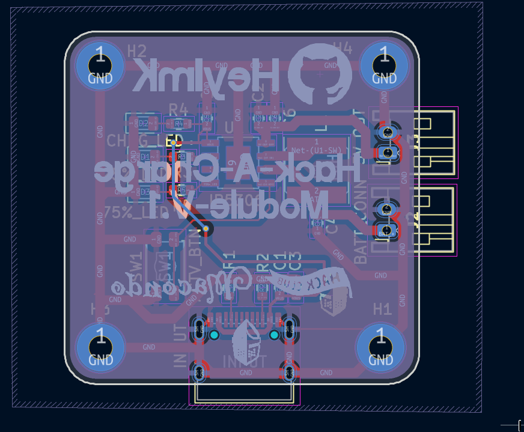

# IP5306 Charging and Power Board

A compact lithium battery charger and 5V boost module built around the IP5306 chip. It handles charging a single-cell lithium battery via USB-C and boosting the battery voltage up to a stable 5V output for external devices.

## Pictures

| Top View | Bottom View |
| :---: | :---: |
|  |  |

## Features

* **Main Chip:** IP5306 handles both 2.1A battery charging and 2.4A synchronous 5V boosting.
* **Custom 3-LED Layout:** Configured with 3 specific status indicators showing Power Connected, Capacity >25%, and Capacity >75%.
* **Thermal Design:** Uses the ESOP-8 package with the exposed bottom power pad soldered directly to ground vias for cooling.
* **5V Output:** Solid 5V power line capable of supplying up to 2.1A to drive microcontrollers, displays, or peripherals.
* **Battery Connector:** Standard right-angle 2-pin JST-XH socket keeping the battery wire connection flat and low-profile.

## Core Components Used

* **Power Management IC:** Injoinic IP5306 
* **Power Inductor:** Sunlord SWPA6045S1R0NT (1.0µH, 5.6A saturation current, 6x6x4.5mm SMD package)
* **Input/Output Capacitors:** Murata 10µF 25V X5R 0603 Ceramic Caps (used on input, battery, and in parallel on the 5V output rail)
* **Spike Filter:** Murata 0.1µF 50V X7R 0603 Ceramic Cap (placed on the USB input)
* **Battery Connector:** Xunpu WAFER-XH2.54-2PWZ right-angle 2-pin socket
* **Indicators:** Everlight 0805 LEDs of different colours with 1kΩ current-limiting resistors

| Circuit Schematic Design |
| :---: |
|  |

| PCB Top Layer Routing | PCB Bottom Layer Routing |
| :---: | :---: |
|  |  |

### Connections
* **5V_OUT** 5V Output (at near 2.1 Amps) from the ip5306 in-built boost circuit.
* **BATT_CONN** The connector to connect the battery with the pcb for charging and output.
* **ACTV_BTN** For manual ON/OFF control and forced shut down and to check battery percentage when needed.

## License

This hardware project is open-source and licensed under the CERN Open Hardware Licence Version 2 - Strongly Reciprocal (CERN-OHL-S-2.0). 

You are free to copy, modify, distribute, and manufacture this board for personal or commercial use. However, if you modify these schematic or layout files and distribute your new design, you must release those modifications under this exact same CERN-OHL-S-2.0 license.

This design is shared without any warranty or implied guarantee. Check the LICENSE file for the full legal text.
